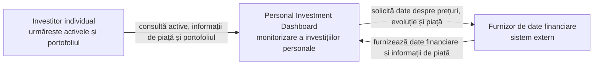

	# Laboratorul 1 — Definirea produsului inițial

**Produs:** Personal Investment Dashboard
**Cererea clientului:** „Ajută-mă să îmi urmăresc investițiile.”

## 1. Cercetarea produsului

### Întrebarea de cercetare

> Cum ajută produsele existente un utilizator să urmărească informațiile despre piață și ce părți aparțin primei versiuni a acestui Dashboard?

| Produs | Utilizatorul probabil și obiectivul său | Model reutilizabil |
|---|---|---|
| **Google Finance** | Un investitor individual care dorește să urmărească prețuri, grafice, știri și instrumentele financiare care îl interesează. | **Watchlist personal**, informații curente despre un activ, evoluție în timp și știri asociate. Google indică faptul că utilizatorul poate găsi cotații, grafice și știri financiare, precum și să creeze liste personale de instrumente urmărite |
| **TradingView** | Un investitor sau trader care dorește să urmărească mai multe active și să le analizeze evoluția. | **Listă de active urmărite**, date esențiale despre active, știri și comparație vizuală a evoluției. TradingView arată că watchlist-urile permit adăugarea și eliminarea simbolurilor și urmărirea știrilor, datelor fundamentale și rezumatelor tehnice. |

### Decizia pentru prima versiune

Cercetarea confirmă că prima versiune trebuie să ofere monitorizare și informare: o listă de active urmărite, date curente, evoluție în timp, informații relevante de piață și situația unui portofoliu personal. Nu include instrumente avansate de analiză sau executarea tranzacțiilor; acestea aparțin unui produs de tranzacționare mai complex.

## 2. Părți interesate și actori

### Părți interesate

| Parte interesată | Motivație | Influență | Motiv |
|---|---|---|---|
| Investitor individual | Ridicată | Ridicată | Folosește produsul pentru a-și urmări activele și portofoliul; nevoile sale stabilesc utilitatea produsului. |
| Proprietarul produsului | Ridicată | Ridicată | Decide prioritățile, limitele și direcția primei versiuni. |
| Furnizor de date financiare | Scăzută | Ridicată | Datele sale influențează direct cât de complete și actuale sunt informațiile oferite utilizatorului. |
| Autorități sau organisme de reglementare | Scăzută | Ridicată | Pot impune reguli privind prezentarea informațiilor financiare și protecția utilizatorului. |
| Echipa de suport | Ridicată | Scăzută | Primește feedback și scopul e ca problemele utilizatorilor să fie rezolvate pentru succesul produsului, dar nu stabilește scopul și nu modifică produsul. |
| Echipa de dezvoltare | Ridicată | Ridicată | Contribuie la perfecționarea produsului, funcționalitatea aplicației depinde de dezvoltatori |

### Matricea motivație × influență

| Motivație | Influență scăzută | Influență ridicată |
|---|---|---|
| Ridicată | Echipa de suport | Investitor individual; Proprietarul produsului; Echipa de dezvoltatori |
| Scăzută | - | Furnizor de date financiare; Autorități sau organisme de reglementare |

### Clasificarea candidaților

| Candidat | Clasificare | Apare în System Context? |
|---|---|---|
| Investitor individual | Actor uman direct | Da |
| Furnizor de date financiare | Sistem extern | Da |
| Proprietarul produsului | Altă parte interesată | Nu |
| Autorități sau organisme de reglementare | Altă parte interesată | Nu |
| Echipa de suport | Altă parte interesată | Nu |

## 3. Promisiunea și domeniul de aplicare ale produsului

### Promisiunea produsului

> **Personal Investment Dashboard ajută investitorul individual să urmărească informațiile despre piață și evoluția propriilor investiții, astfel încât să înțeleagă rapid situația și performanța activelor urmărite.**

### Obiectivele primei versiuni

| Nr. | Obiectiv | Rezultat vizibil pentru utilizator |
|---|---|---|
| 1 | Utilizatorul poate păstra o listă a activelor care îl interesează. | Vede într-un singur loc activele selectate pentru monitorizare. |
| 2 | Utilizatorul poate consulta informații curente despre un activ urmărit. | Vede prețul și variația disponibilă pentru activul ales. |
| 3 | Utilizatorul poate observa evoluția prețului unui activ într-o perioadă. | Poate identifica dacă valoarea activului a crescut sau a scăzut. |
| 4 | Utilizatorul poate consulta informații relevante de piață pentru activele urmărite. | Poate înțelege mai bine contextul evoluției unui activ. |
| 5 | Utilizatorul poate urmări situația și performanța propriului portofoliu. | Vede centralizat activele proprii și performanța disponibilă a acestora. |

### Obiective excluse din prima versiune

| Nr. | Obiectiv exclus | Activitatea eliminată |
|---|---|---|
| 1 | Utilizatorul nu poate cumpăra sau vinde active prin Dashboard. | Executarea tranzacțiilor. |
| 2 | Utilizatorul nu primește recomandări personalizate de investiții. | Consultanța financiară individuală. |
| 3 | Utilizatorul nu poate crea sau executa strategii automate de investiții. | Automatizarea deciziilor și a investițiilor. |

## 4. Cerințe funcționale

### DASH-1 — Urmărirea activelor

**Obiectivul actorului:** Investitorul dorește să păstreze activele care îl interesează pentru a le putea monitoriza ulterior.
**Povestea de Utilizator:** Ca investitor individual, vreau să urmăresc activele care mă interesează, astfel încât să le pot monitoriza fără să le caut de fiecare dată.

**Definițiile To do:**
- Activul selectat de utilizator apare în lista sa de active urmărite.
- Utilizatorul poate adăuga un activ disponibil și poate elimina un activ urmărit.
- Dacă activul solicitat nu este acceptat în domeniul Dashboard-ului, utilizatorul este informat că nu poate fi urmărit.

### DASH-2 — Consultarea informațiilor curente

**Obiectivul actorului:** Investitorul dorește să afle situația curentă a unui activ urmărit.
**Povestea de Utilizator:** Ca investitor individual, vreau să consult informațiile curente despre un activ urmărit, astfel încât să înțeleg situația acestuia.

**Definițiile To do:**
- Pentru un activ disponibil, utilizatorul vede prețul și variația disponibile pentru activul selectat.
- Informațiile prezentate identifică clar activul la care se referă.
- Dacă datele curente lipsesc sau nu sunt acceptate, utilizatorul vede această situație în locul unor informații neverificate.

### DASH-3 — Analizarea evoluției unui activ

**Obiectivul actorului:** Investitorul dorește să afle cum s-a modificat valoarea unui activ într-o perioadă.
**Povestea de Utilizator:** Ca investitor individual, vreau să văd evoluția prețului unui activ în timp, astfel încât să pot observa creșterile și scăderile acestuia.

**Definițiile To do:**
- Pentru un activ cu date istorice disponibile, utilizatorul poate consulta evoluția într-o perioadă aleasă.
- Valorile sunt prezentate într-o ordine temporală clară.
- Dacă datele istorice sunt incomplete sau învechite, utilizatorul este informat despre acest lucru.

### DASH-4 — Consultarea informațiilor de piață
**Obiectivul actorului:** Investitorul dorește să găsească informații relevante pentru activele urmărite.
**Povestea de Utilizator:** Ca investitor individual, vreau să consult informații relevante despre piață și activele urmărite, astfel încât să înțeleg mai bine evoluția acestora.

**Definițiile To do:**
- Când există informații relevante, utilizatorul le poate consulta pentru activul sau contextul de piață corespunzător.
- Informațiile indică sursa și momentul la care au fost publicate sau actualizate.
- Dacă nu există informații relevante, utilizatorul este informat despre lipsa lor.
- Informațiile sunt oferite pentru monitorizare, fără recomandări personalizate de investiții.

### DASH-5 — Monitorizarea portofoliului

**Obiectivul actorului:** Investitorul dorește să înțeleagă situația agregată a investițiilor sale.
**Povestea de Utilizator:** Ca investitor individual, vreau să îmi urmăresc portofoliul și performanța acestuia, astfel încât să văd situația investițiilor mele într-un singur loc.

**Definițiile To do:**
- Utilizatorul poate consulta activele declarate ca parte a propriului portofoliu.
- Pentru activele cu date disponibile, utilizatorul vede valoarea și performanța disponibile ale portofoliului.
- Dacă datele necesare lipsesc sau sunt învechite, utilizatorul vede că performanța portofoliului poate fi incompletă.
- Dashboard-ul permite monitorizarea portofoliului, nu cumpărarea sau vânzarea de active.

## 5. C4 System Context view
### Limita sistemului
**Personal Investment Dashboard** include activitățile de monitorizare și informare ale investitorului. Furnizorul extern rămâne sursa datelor financiare; Dashboard-ul prezintă utilizatorului aceste date într-un mod clar și semnalează datele lipsă, învechite sau neacceptate.  

| Sistem extern | Responsabilitatea Dashboard-ului care depinde de el | Rezultatul furnizat | Ce vede utilizatorul dacă rezultatul are o problemă |
|---|---|---|---|
| Furnizor de date financiare | Informarea despre active, evoluția lor și performanța portofoliului | Date despre prețuri, evoluție și informații de piață | Un mesaj clar că datele lipsesc, sunt învechite sau nu sunt acceptate; nu sunt prezentate ca date curente verificate. |

## Listă de verificare
- [x] Au fost cercetate două produse existente și au fost incluse dovezi citate. ✅ 2026-09-15
- [x] Cercetarea a confirmat domeniul primei versiuni.
- [x] Părțile interesate au fost evaluate după motivație și influență și au fost clasificate.
- [x] Promisiunea, obiectivele și obiectivele excluse sunt consecvente.
- [x] Sunt definite cinci povești de Utilizator, fiecare cu 2–4 definiții observabile de Făcut.
- [x] Rezultatele lipsă, învechite sau neacceptate sunt vizibile pentru utilizator.
- [x] Este inclus un C4 System Context view simplu, cu actorul direct și sistemul extern.